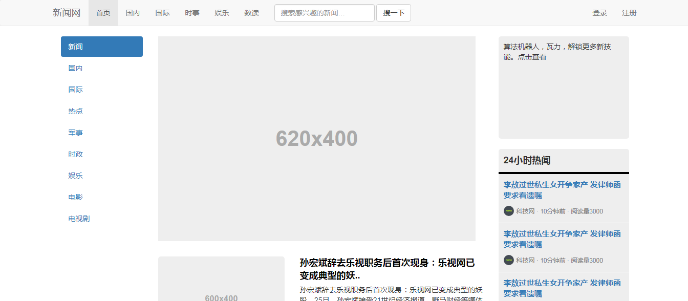

# 前端练习项目

记录我在学习前端过程中做过的小demo。

demo列表：

- [维基搜索](#02)
- [弹幕](#01)
- [响应式新闻网](#03)
- [诗歌鉴赏网](#04)
- [博客主页](#05)
- [随机引言](#06)
- [贪吃蛇小游戏](#07)

## <h2 id='#02'>维基搜索</h2>

### 功能

调用维基api实现维基词条中英文对比搜索- 可以查看随机词条、热门词条 

#### 项目特点

- 实现热门内容瀑布流动态展示

- 解决Ajax跨域问题

- 留有扩展接口，可以扩展更多功能

### 在线预览

源代码：[查看源代码]()

预览：[查看Demo](https://codepen.io/Anilway/full/jzwzZo)

## <h2 id='01'>弹幕APP</h2>

### 功能

多人在线实时通信聊天。

### 实现原理

使用原生JS，调用野狗云SDK，将弹幕数据储存在野狗云。通过客户端监听云端数据变化，当新增数据时产生弹幕。

### 在线预览

源代码：[查看源代码]()

预览：[查看Demo](https://codepen.io/Anilway/full/ZxpMog/)

### 训练

- 原生JS DOM的运用
- API文档学习与运用
- 理解前后端的通信方式

## <h2 id='#03'>响应式新闻网</h2>

### 在线预览

源代码：[查看源代码]()

预览：[查看Demo]()

## <h2 id='#04'>诗歌鉴赏平台</h2>

### 在线预览

源代码：[查看源代码]()

预览：[查看Demo]()

## <h2 id='#05'>博客主页</h2>

### 在线预览

源代码：[查看源代码]()

预览：[查看Demo]()

## <h2 id='#06'>随机引言</h2>

### 功能

随机生成历史上曾经出现过的经典语录，或古典或现代，或中文或英文，或严肃或轻佻。你永远不知道下一句会是什么。可将语录分享到微博端和微信端。

### 实现原理

调用语录API，通过ajax传输技术，实现浏览器与 web 服务器之间的异步数据传输，使网页从服务器请求少量的信息。

- 通过ajax向服务器发送请求，服务器端返回我们需要的JSON数据，然后使用json2.js库，调用`JSON.parse()`函数将字符串转换成json对象。接着向页面放入需要的数据部分。
- 微信、微博分享。也通过get或post方式将数据传至服务器端。

### 训练方向

- 理解同步和异步的的区别，如何在获取数据后再渲染？
- 练习封装原生的Ajax函数
- 理解GET和POST方法的区别，并在微博、微信分享上进行练习使用
- 通过API获取数据、通过GET、POST传输数据，从而理解前后端的交互方式
- 学习书写简单的php文件，本地模拟浏览器端和服务器端的数据传输方式

### 在线预览

源代码：[查看源代码]()

预览:[查看Demo](https://codepen.io/Anilway/full/BrQoLo/)

## <h2 id='07'>贪吃蛇小游戏</h2>

### 在线预览

源代码：[查看源代码]()

预览:[查看Demo]()

